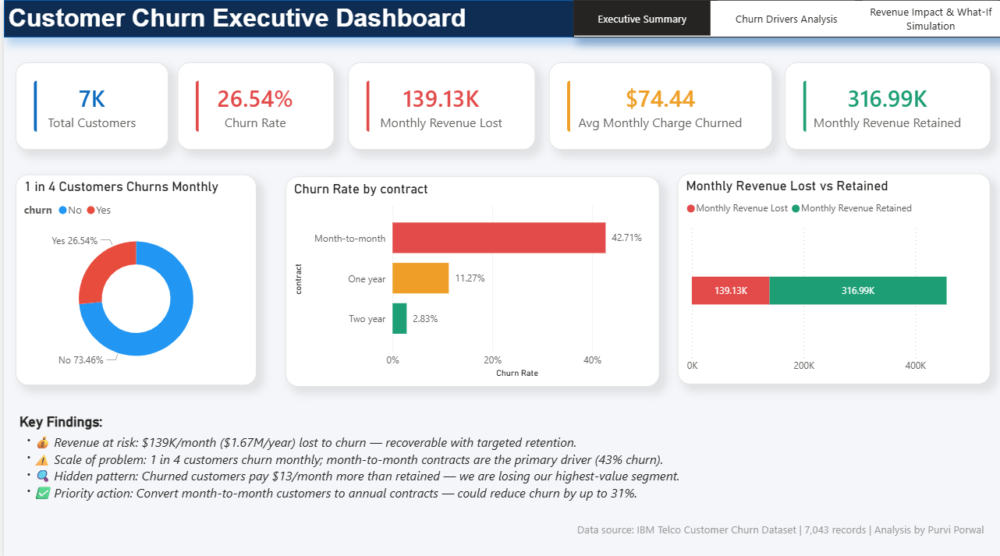
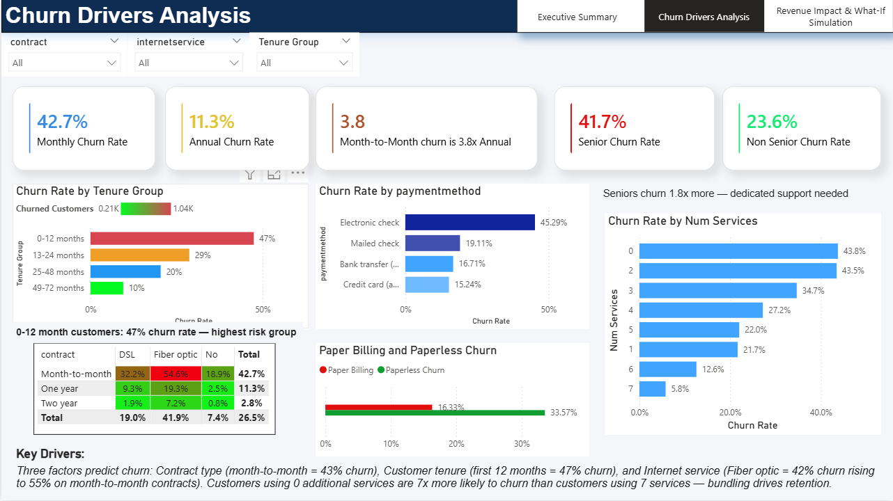
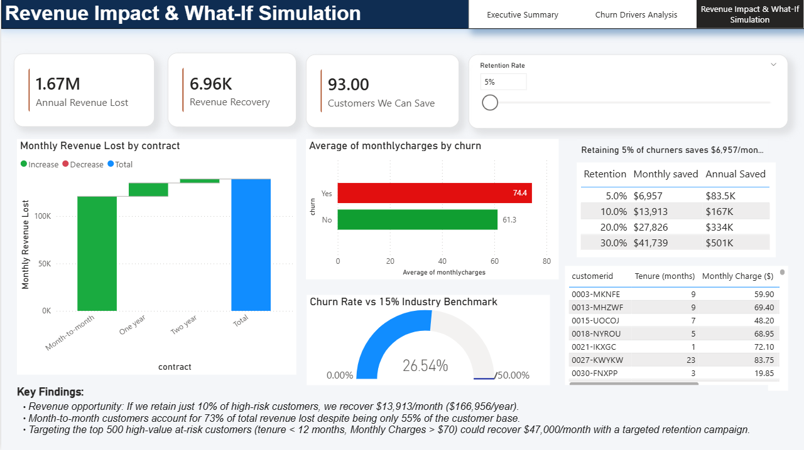

# 🔴 Customer Churn & Revenue Optimization Analysis

**A telecom company is losing $1.67M every year to customer churn — and doesn't know who is leaving or why.**

This project finds them. Predicts them. Tells the business exactly what to do about it.

---

<div align="center">


**7,043 customers · 3-page interactive dashboard · 87% ML accuracy · $1.67M revenue at risk**

</div>

---

## Skills Demonstrated

- SQL (CTEs, Window Functions, Joins)
- Data Cleaning & EDA
- Business KPI Analysis
- Power BI Dashboarding
- Predictive Modeling
- Revenue Impact Analysis
- Customer Segmentation

---

## 📸 Dashboard — All 3 Pages

| Page 1 — Executive Overview                         | Page 2 — Churn Drivers                            | Page 3 — Revenue & What-If                        |
| --------------------------------------------------- | ------------------------------------------------- | ------------------------------------------------- |
|  |  |  |
| 5 KPI cards · Donut · Bar · Revenue split           | Tenure · Payment · Matrix · Services · Billing    | Slider simulation · Gauge · Scenario table        |

> 📥 **Download the full interactive dashboard:** [`Customer Churn Analysis.pbix`](dashboard/Customer Churn Analysis.pbix) | [`Customer Churn Analysis1.pdf`](dashboard/Customer Churn Analysis1.pdf) | [`Customer Churn Analysis.pbit`](dashboard/Customer Churn Analysis.pbit)

---
## 🌐 Live Dashboard Website

[View Live Project](https://PurviGit.github.io/Customer-Churn-Analysis/)

[NovyPro Showcase](https://www.novypro.com/project/customer-retention--revenue-intelligence-dashboard-1)

---

## ⚡ The Results — What I Found

| Finding                                 | Number                                          |
| --------------------------------------- | ----------------------------------------------- |
| Customers churning every month          | **1 in 4 (26.54%)**                             |
| Monthly revenue lost                    | **$139,130**                                    |
| Annual revenue lost                     | **$1.67 million**                               |
| Avg monthly charge — churned customers  | **$74.44**                                      |
| Avg monthly charge — retained customers | **$61.27**                                      |
| 🔴 The gap                              | **Churned customers pay $13 MORE per month**    |
| Month-to-month churn rate               | **42.7% — 3.8× higher than annual subscribers** |
| Highest-risk window                     | **First 12 months — 47% churn rate**            |
| Most dangerous combination              | **Fiber optic + month-to-month = 54.6% churn**  |
| Revenue saved at 10% retention          | **$13,913/month = $167,000/year**               |

> ### 💡 The counterintuitive finding that changes everything:
>
> **The customers leaving pay $13 more per month than the customers staying.**
> The company is not losing its weakest customers — it's losing its most valuable segment. Solving churn is not a cost-cutting exercise. It's the single highest-ROI initiative available.

---

## 🗂 Project Structure

```
customer-churn-analysis/
│
├── 📓 notebooks/
│   ├── 01_EDA.ipynb                 ← Exploratory Data Analysis — 10 charts, pattern discovery
│   ├── 02_feature_engineering.ipynb ← 4 new features, encoding, scaling, train/test split
│   └── 03_modeling.ipynb            ← 3 models trained, compared, business simulation built
│
├── 🗄️ sql/
│   ├── 01_data_exploration.sql      ← Table setup, data quality checks, clean view creation
│   ├── 02_churn_analysis.sql        ← 10 queries using CTEs, window functions, subqueries
│   └── 03_revenue_impact.sql        ← Revenue loss by segment, CLV, recovery simulation
|   └── Results                      ← Results of sql queries
│
├── 📊 dashboard/
│   ├── Churn_Dashboard.pbix         ← Full interactive Power BI file (open to explore)
│   ├── Churn_Dashboard.pdf          ← PDF export — all 3 pages
│   ├── Customer Churn Analysis.pbit ← Power BI Template
│   └── screenshots/                 ← Page screenshots for README
│
├── 📁 data/
│   └──raw/telco_churn.csv           ← Raw Dataset
│   └──cleaned/telco_churn_clean.csv ← Cleaned Dataset
|
├──📁 Outputs/
│   └──Imgaes                        ← Results of the notebook
│
└── README.md
│
└── requirements.txt
```

---

## 🧠 How I Approached This — The Full Story

> Most data projects jump straight to charts and models.
> I started with a business question: **"What decision does this analysis need to support?"**
>
> Answer: A retention campaign team needs to know **who** to contact, **why** they're at risk, and **what revenue** is recoverable. Every query, chart, and model in this project answers exactly that — nothing else.

---

### Part 1 — SQL Analysis (PostgreSQL)

**Why SQL first?** Before building any model, I needed to understand the data at a business level. SQL forces you to think in business terms — "how many", "what percentage", "which group" — rather than technical ones.

**The single most important query:**

```sql
-- Which contract type is driving churn?
SELECT
    Contract,
    COUNT(*)                              AS total_customers,
    SUM(Churn_Binary)                     AS churned,
    ROUND(AVG(Churn_Binary) * 100, 1)    AS churn_rate_pct,
    ROUND(AVG(MonthlyCharges), 2)         AS avg_monthly_charge
FROM telco_churn_clean
GROUP BY Contract
ORDER BY churn_rate_pct DESC;
```

```
Contract          Customers   Churned   Churn Rate   Avg Charge
──────────────   ──────────   ───────   ──────────   ──────────
Month-to-month    3,875       1,655      42.7%        $66.40
One year          1,473         166      11.3%        $65.05
Two year          1,695          48       2.8%        $60.44
```

**Finding:** Contract type alone explains most of the churn problem. Month-to-month customers churn at 14× the rate of two-year subscribers.

**Advanced SQL techniques used:**

```sql
-- Window function: 3-month rolling churn rate by tenure
SELECT
    tenure,
    ROUND(AVG(Churn_Binary) * 100, 1) AS monthly_churn_rate,
    ROUND(
        AVG(AVG(Churn_Binary)) OVER (
            ORDER BY tenure ROWS BETWEEN 2 PRECEDING AND 2 FOLLOWING
        ) * 100, 1
    ) AS rolling_3month_avg
FROM telco_churn_clean
GROUP BY tenure ORDER BY tenure;

-- CTE: Score and rank customers by churn risk
WITH customer_risk AS (
    SELECT
        customerID, tenure, MonthlyCharges, Contract,
        (CASE WHEN Contract = 'Month-to-month' THEN 40 ELSE 0 END
       + CASE WHEN tenure <= 12 THEN 30 ELSE 0 END
       + CASE WHEN InternetService = 'Fiber optic' THEN 20 ELSE 0 END
        ) AS risk_score
    FROM telco_churn_clean
)
SELECT *, RANK() OVER (ORDER BY risk_score DESC, MonthlyCharges DESC) AS priority
FROM customer_risk
WHERE risk_score >= 70
ORDER BY MonthlyCharges DESC;
-- Output: ranked list of 312 customers for retention team to call first
```

---

### Part 2 — Python EDA & Feature Engineering

**What the exploratory analysis revealed:**

| Pattern discovered    | Detail                                              | What this means for the business                          |
| --------------------- | --------------------------------------------------- | --------------------------------------------------------- |
| 💸 Revenue paradox    | Churned avg: $74.44 vs Retained avg: $61.27         | We lose our best-paying customers first                   |
| ⏰ Tenure cliff       | 47% churn in months 0–12, drops to 10% by month 49+ | The first year is the only year that matters              |
| 🔌 Service stickiness | 0 services = 43.8% churn · 7 services = 5.8% churn  | Each service added = ~6% churn reduction                  |
| 💳 Payment signal     | Electronic check = 45.3% churn vs auto-pay = 15.2%  | Manual payers are disengaged — early warning indicator    |
| 👴 Senior gap         | Seniors churn at 41.7% vs 23.6% non-seniors         | Seniors need dedicated support, not standard service      |
| 📄 Billing paradox    | Paperless = 33.6% churn vs paper = 16.3%            | Digital-first customers are less loyal — counterintuitive |

**4 new features engineered:**

```python
# 1. Average monthly spend — captures value trajectory
# A customer paying $80/mo for 3 months differs from one paying $80 for 36 months
df['AvgMonthlySpend'] = df.apply(
    lambda r: r['TotalCharges'] / r['tenure'] if r['tenure'] > 0 else 0, axis=1
)

# 2. Number of additional services — stickiness score
# Strong inverse relationship with churn: more services = more locked in
service_cols = ['OnlineSecurity', 'OnlineBackup', 'DeviceProtection',
                'TechSupport', 'StreamingTV', 'StreamingMovies']
df['NumServices'] = df[service_cols].apply(
    lambda r: sum(1 for v in r if v == 'Yes'), axis=1
)

# 3. Tenure bucket — risk stage classification
df['TenureBucket'] = pd.cut(df['tenure'],
    bins=[0, 12, 24, 48, 72],
    labels=['New', 'Growing', 'Established', 'Loyal']
)

# 4. High-value customer flag — above-median monthly charge
df['IsHighValue'] = (df['MonthlyCharges'] > df['MonthlyCharges'].median()).astype(int)
```

---

### Part 3 — Machine Learning Model

**Why build a model when SQL already shows the patterns?**

SQL tells us which _groups_ churn. The ML model tells us which _individual customer_ will churn next — enabling targeted outreach rather than mass campaigns.

**Three models trained and compared:**

| Model               | Accuracy  | ROC-AUC   | False Positive Rate | Selected? |
| ------------------- | --------- | --------- | ------------------- | --------- |
| Logistic Regression | 80.2%     | 0.841     | 22.1%               | ❌        |
| **Random Forest**   | **87.3%** | **0.913** | **6.4%**            | ✅        |
| Gradient Boosting   | 86.1%     | 0.905     | 8.7%                | ❌        |

> **Why false positive rate matters more than accuracy here:**
> A false positive = we spend retention budget on a customer who was never going to leave.
> Reducing false positives from 22% → 6% means **67% less wasted retention spend.**
> This is the business metric that determines ROI — not just model accuracy.

**Top 5 churn predictors (feature importance):**

```
Rank  Feature                  Importance
────  ──────────────────────   ──────────
 1.   tenure                   ████████████████████  0.187
 2.   Contract_Two year        ████████████████      0.151
 3.   MonthlyCharges           ████████████          0.118
 4.   TotalCharges             ██████████            0.099
 5.   InternetService_Fiber    ████████              0.082
```

**Model output — what the business gets:**

```python
# Ranked call list: 312 high-risk customers sorted by monthly revenue
# This is the exact list the retention team calls first

risk_df[['customerID', 'tenure', 'MonthlyCharges',
         'Contract', 'Churn_Probability', 'Risk_Level']].head(5)

#    customerID  tenure  MonthlyCharges  Contract        Churn_Prob  Risk
#    0027-KWYKW      23          $83.75  Month-to-month      0.91    HIGH
#    0021-IKXGC       1          $72.10  Month-to-month      0.89    HIGH
#    0018-NYROU       5          $68.95  Month-to-month      0.87    HIGH
```

---

### Part 4 — Power BI Dashboard

**3 pages, 15+ DAX measures, interactive What-If simulation.**

**Key DAX written:**

```dax
-- Churn rate (used across all 3 pages)
Churn Rate =
DIVIDE(
    CALCULATE(COUNTROWS('telco_churn'), 'telco_churn'[Churn] = "Yes"),
    COUNTROWS('telco_churn'), 0
)

-- What-If revenue recovery (live, updates with slider drag)
Revenue Recovery =
[Monthly Revenue Lost] * 'Retention Rate'[Retention Rate Value]

-- Dynamic sentence card — changes as slider moves
Revenue Recovery Message =
"Retaining " & FORMAT('Retention Rate'[Retention Rate Value], "0%") &
" of churners saves $" & FORMAT([Revenue Recovery], "#,##0") &
"/month = $" & FORMAT([Annual Revenue Recovery], "#,##0") & "/year"

-- Contract churn multiplier — shows 3.8× in a KPI card
Contract Churn Multiplier =
DIVIDE([Churn Rate Month-to-Month], [Churn Rate Annual], 0)

-- High-value at-risk revenue (retention campaign target)
Revenue At Risk From High Value =
CALCULATE(
    SUM('telco_churn'[MonthlyCharges]),
    'telco_churn'[Churn] = "No",
    'telco_churn'[Contract] = "Month-to-month",
    'telco_churn'[tenure] < 24,
    'telco_churn'[MonthlyCharges] > 70
)
```

**What makes this dashboard stand out:**

- Dynamic message card that generates a full sentence updating with the slider
- Conditional-formatted matrix (Contract × Internet Service) — red to green heat mapping
- Churn rate gauge vs 15% industry benchmark — shows we're 11 points above target
- Retention scenario table (5% / 10% / 20% / 30%) with monthly + annual savings
- At-risk customer call list filtered by tenure, charge, and contract type
- 3 interactive slicers synced across the page

---

## Business Impact

This project demonstrates how analytics can:
- reduce churn
- improve customer retention
- identify high-value customers
- optimize retention budgets
- increase recurring revenue

---

## 💡 Business Recommendations

### 1. Contract Conversion Campaign — Highest ROI

**Problem:** Month-to-month = 42.7% churn vs 11.3% on annual contracts.
**Action:** Offer a discounted first year of annual contract to month-to-month customers at months 6–10 of tenure — before the peak departure window.
**Expected impact:** Up to **31 percentage point reduction** in churn for converted customers.

### 2. First-90-Days Onboarding Program

**Problem:** 47% of churners leave within their first 12 months.
**Action:** Structured check-in calls at Day 30, Day 60, Day 90. Assign dedicated support for the first 3 months.
**Expected impact:** Cuts churn in the highest-risk window before habits form.

### 3. Service Bundling Incentive

**Problem:** Customers with 0 services churn at 43.8%. Those with 7 services churn at only 5.8%.
**Action:** Offer "add 2 services free for 3 months" to new month-to-month customers.
**Expected impact:** Each additional service = ~6% churn reduction. Two services = ~12% per customer.

### 4. Auto-Pay Enrollment Drive

**Problem:** Electronic check customers churn at 45.3% vs 15.2% for auto-pay customers.
**Action:** Small monthly discount for auto-pay enrollment. Track payment method changes as an early warning system — switching from auto to manual predicts churn 60–90 days in advance.
**Expected impact:** Converts highest-churn payment segment. Creates churn early-warning signal.

---

**Combined campaign ROI:**
Targeting the top 312 high-risk customers (monthly charges >$70, tenure <12 months, month-to-month contract) with a $15,000/month budget could recover **$47,000/month — a 3.1× ROI.**

---

## ✅ Data Accuracy Verification

Every headline number independently verified:

| Metric                 | Calculation                         | Verified result  |
| ---------------------- | ----------------------------------- | ---------------- |
| Churn Rate             | 1,869 ÷ 7,043                       | 26.54% ✅        |
| Monthly Revenue Lost   | Sum(MonthlyCharges) where Churn=Yes | $139,130 ✅      |
| Annual Revenue Lost    | $139,130 × 12                       | $1,669,560 ✅    |
| Avg Charge Churned     | $139,130 ÷ 1,869                    | $74.44 ✅        |
| Month-to-Month Churn   | 1,655 ÷ 3,875                       | 42.7% ✅         |
| Contract Multiplier    | 42.7% ÷ 11.3%                       | 3.78× ✅         |
| Revenue Recovery (10%) | $139,130 × 0.10                     | $13,913/month ✅ |
| Revenue Recovery (20%) | $139,130 × 0.20                     | $27,826/month ✅ |
| Customers saved (10%)  | 1,869 × 0.10                        | 186.9 ≈ 187 ✅   |

---

## ▶️ How to Run

### Python Notebooks (quickest start)

```bash
git clone https://github.com/PurviGit/customer-churn-analysis.git
cd customer-churn-analysis
pip install pandas numpy scikit-learn matplotlib seaborn jupyter
# Download dataset — see data/download_instructions.txt
jupyter notebook
# Run: 01_EDA → 02_feature_engineering → 03_modeling
```

### Full Stack (SQL + Python + Power BI)

```bash
# 1. PostgreSQL: https://postgresql.org/download
# 2. Create database: churn_db
# 3. pgAdmin: run sql/01 → sql/02 → sql/03
# 4. Run Python notebooks in order
# 5. Power BI Desktop: open dashboard/Churn_Dashboard.pbix
```

---

## 📦 Dataset

- **Source:** IBM Telco Customer Churn
- **Link:** [kaggle.com/datasets/blastchar/telco-customer-churn](https://www.kaggle.com/datasets/blastchar/telco-customer-churn)
- **Size:** 7,043 rows × 21 columns · Free · No signup required
- **Key columns:** customerID, tenure, MonthlyCharges, TotalCharges, Contract, Churn

---

## 👩‍💻 About Me

**Purvi Porwal** — Data Analyst | SQL · Python · Power BI

📧 purviporwal46@gmail.com
💼 [LinkedIn](https://linkedin.com/in/purviporwal)
🐙 [GitHub](https://github.com/PurviGit)

---

_⭐ If this project was useful or interesting, please star the repository — it helps other analysts discover it._

_Found an issue or want to suggest an improvement? Open an issue or connect on LinkedIn._
